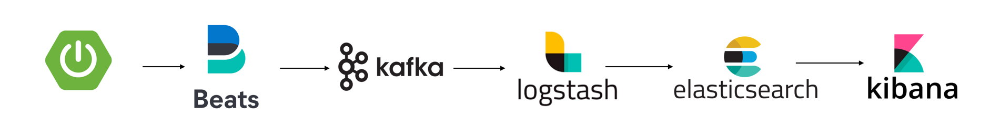
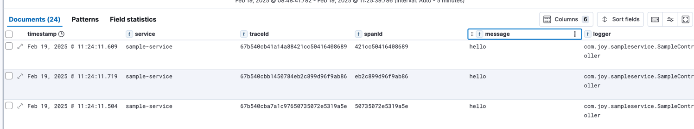
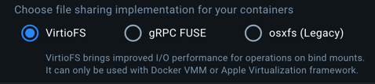
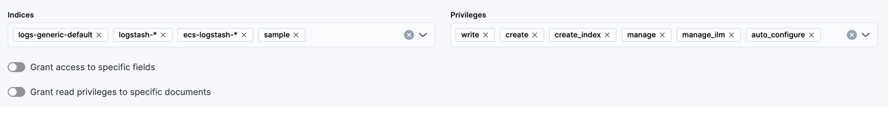

# elk-example
elasticsearch, logstash, kibana + filebeat &amp; kafka logging example



# Quick Start

```aiignore
docker-compose up setup
docker-compsoe up
```

### Test log

localhost:8888





### 알게된 것들 끄적

- Docker 볼륨설정한 파일이 동기화 되지 않는이슈
  - 로컬에서 생성된 로그파일을 볼륨을 잡아놨는데 컨테이너에 동기화 되지 않아 filbeat&kafka가 읽어가지 못함 
  - https://github.com/docker/for-mac/issues/7274
  - gRPC FUSE를 사용하는 도커 자체의 버그로 확인
  - docker desktop 4.8.2버전 사용중이었는데 해당버전에서는 파일공유 옵션이 기본 gRPC FUSE인듯
  - 업데이트 해보니 기본 옵션이 VirtioFS
  - 4.31.0 버전 이후로 수정되었다고하지만 업데이트하고 확인해봤는데 여전히 동기화되지 않음
  - use gRPC FUSE for file sharing 옵션이 버그의 원인. gRPC FUSE를 사용중이라면 옵션을 VirtioFS로 선택 
    


- mdc?
  - Mapped Diagnostic Context
  - 요청 스레드에 할당된 스레드 로컬에 넣어주는 추가 정보?
  - trace id, span id에 해당
  - spring boot 3.x버전은 분산추적위해 micrometer사용하니까 w3c방식 -> 헤더명이 trace-id, span-id -> traceId, spanId로 해야 읽히네
  ```xml
     <mdc>
          <includeMdcKeyName>traceId</includeMdcKeyName>
          <includeMdcKeyName>spanId</includeMdcKeyName>
      </mdc>
  ```
- log_internal 권한에러
  - logstash.conf에 인덱스명을 지정했더니 인덱스를 생성할 수 없다고 오류 발생
    - logstash_internal 계정이 인덱스 생성에 필요한 권한이 없다?
    - 일단 임시로 이렇게 인덱스 추가할수 있는 권한을 생성
      
- filebeat와 kafka 동시 사용이 필요한가? -> 잘모르겠음
  - logback에서 카프카appender로 바로 카프카에 쏴주면 관리포인트 줄고 간단?
    - kafka에 대한 의존성이 생김 kafka 장애발생 시 로그 전송할 수 없을 것
    - 그럼 filebeat가 파일에 로그를 모아두고 kafka 장애 회복시 장애시점 이후의 로그부터 카프카에 줄 수 있는가?
      - 테스트 해봐야될 듯(시간 나면)

